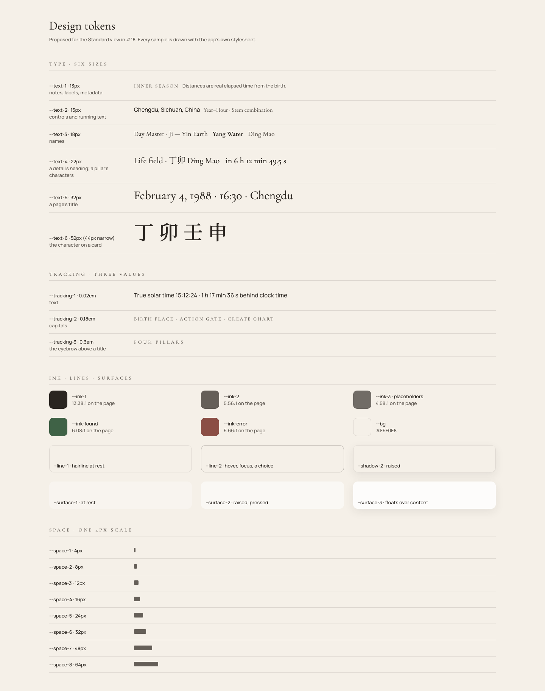

# Design Tokens (Standard view)

The Standard view's stylesheet, `eight_characters/static/style.css`, takes every
colour, space, font size and tracking from tokens defined once on `:root`.
Outside those definitions it holds no raw spacing, font size, tracking or ink
value: `tests/test_api_index_route.py`
(`test_stylesheet_takes_spacing_type_and_ink_from_its_tokens`) fails on any.

## Colour

| Token | Value | Use |
|---|---|---|
| `--bg` | `#F5F0E8` | the page |
| `--ink-1` | `#2A2520` | text (13.4:1 on the page) |
| `--ink-2` | `#655F58` | labels, notes, secondary text (5.6:1) |
| `--ink-3` | ink at 65% | placeholders (4.6:1) |
| `--ink-found`, `--ink-error` | `#3F6246`, `#8B4E45` | a found place; an error (6.1:1, 5.7:1) |
| `--line-1`, `--line-2` | ink at 12%, 30% | a hairline at rest; hover, focus, a current choice |
| `--surface-1`, `--surface-2`, `--surface-3` | white at 30%, 50%, 80% | at rest; raised or pressed; floating over content |
| `--surface-page-1`, `--surface-page-2` | the page tone at 85%, 92% | an option under the pointer; the active option |
| `--shadow-1`, `--shadow-2`, `--shadow-sheet` | | a focused field; anything raised; the sheet over the foot of the page |
| `--sheen` | | the light across a card's face |
| `--<element>-bg`, `--<element>-text`, `--<element>-tint` | the tint: its element at 20% on the page tone (22% for metal and water), mixed opaque with `color-mix()` | each element's cards, their ink, and its hidden-stem panels |

`--ink-1` and `--ink-2` meet WCAG AA (4.5:1) on the page and on every
element-tinted panel. De-emphasis comes from size, case and tracking, not from a
lighter ink.

### The dark theme

On screen, when the system's setting is dark (`prefers-color-scheme: dark`), the
colour tokens take the embers palette. It was chosen from three drawn on the chart.
Space, type and every rule that uses the tokens stay as they are. The page declares
its scheme (`color-scheme`), so the browser's own controls, such as the date and time
pickers, follow it. Paper keeps the day's colours.

| Token | Dark value |
|---|---|
| `--bg` | `#1C1916` |
| `--ink-1`, `--ink-2` | `#EEE7DC` (14.3:1), `#B2A99C` (7.5:1) |
| `--ink-3` | the ink at 60% |
| `--ink-found`, `--ink-error` | `#93C29B`, `#E6A094` |
| `--line-1`, `--line-2` | the ink at 14%, 34% |
| `--surface-1`, `--surface-2`, `--surface-3` | white at 4%, 8%; `#2C2824` at 96% |
| `--surface-page-1`, `--surface-page-2` | the page tone at 85%, 92% |
| `--shadow-*`, `--backdrop`, `--sheen` | black at 35–55%; white light at 8% |
| `--metal-bg` / `--metal-text` | `#5C5851` / `#F3EFE8` |
| `--fire-bg` / `--fire-text` | `#7C3E34` / `#F8E6E1` |
| `--wood-bg` / `--wood-text` | `#3D5C38` / `#E7F1E4` |
| `--earth-bg` / `--earth-text` | `#6B5E2E` / `#F5EED4` |
| `--water-bg` / `--water-text` | `#384E5F` / `#E4EEF5` |

The tints mix the deep element colours on the dark page, by the same formula as by
day. Each element's type meets AA on its card (5.5:1 or more), `--ink-2` does on every
tint (5.7:1 or more), and each element's ring is 3:1 or more on every surface. The
foundations suite measures this in every state of both themes.

## Space

`--space-1` to `--space-8`: 4, 8, 12, 16, 24, 32, 48 and 64px. Margins, padding
and gaps use only these, or `calc()` of them.

## Type

| Token | Size | Use |
|---|---|---|
| `--text-1` | 13px | notes, labels, metadata: the smallest size for content |
| `--text-2` | 15px | controls and running text |
| `--text-3` | 18px | names |
| `--text-4` | 22px | a detail's heading; a pillar's characters |
| `--text-5` | 32px | a page's title |
| `--text-6` | 52px (44px up to 640px wide) | the character on a card |

- Families: `--font-serif` (Cormorant Garamond), `--font-sans` (Manrope), and
  `--font-glyph` (the Noto Serif TC subset of the 22 stems and branches). The
  serif and sans stacks name the Noto face second, so the stems and branches look
  the same wherever they appear.
- Tracking: `--tracking-1` (0.02em) for text, `--tracking-2` (0.18em) for
  capitals, `--tracking-3` (0.3em) for the eyebrow above a title. They are in em,
  so they follow the size.
- Weight 300 is not used below display sizes.

## The pillars and the panel

- One grid holds all four pillars: four columns, two up to 640px wide. Each
  pillar spans eight shared rows (label, name, mark, stem arcs, stem, branch,
  hidden stems, branch arcs) as a subgrid, with its header and its cards as
  nested subgrids. The rows line up across the pillars, and the cards of a row
  share one height, front and back. Opened hidden stems grow their own row, in
  the flow: nothing hangs over what follows. `tests/browser/design-system.test.mjs`
  checks this from 641px to 1440px, in both languages.
- The relationship arcs lie in their own rows, under the pillars. Each row keeps
  one height whatever the arcs in it, so the cards stand in the same place; up
  to 640px there are no arcs and the rows are empty.
  - `--arc-base`, `--arc-step`: the rise of the lowest arc, and of each level
    above it: 6 and 8px.
  - `--arc-band`: the height of each arcs' row, room for four levels: 40px.
  - `--arc-spread`: the distance between the feet of arcs that meet on one card:
    6px.
- `--card-min-height`: a card's least height (160px up to 640px wide).
- `--hidden-stem-row`: the line of a hidden stem in its panel.
- `--chart-width`: the chart column, 960px.
- `--panel-width`: the panel that explains a topic beside the chart, from 1200px
  wide: 420px.
- `--sheet-height`: narrower, the panel is a sheet over the foot of the page, at
  most half the screen tall. The chart keeps as much room below it to scroll
  clear of the sheet.
- A page in the panel reads from the left:
  - its title in `--text-4`;
  - a line in `--ink-2`;
  - its content;
  - one note at its foot in `--text-1`, at most 35em wide: about 60 to 75
    characters to the line.

  Its labels, a pillar's plain name or a group of roles, take the column
  header's capitals. The roles matrix is no wider than `--panel-width`, so on a
  wide sheet each mark stays near its role.
- What a line in the panel points at is ringed on the chart in `--ink-1`:
  - a card with a 2px outline at no offset, so the ring stays within half the 4px gap
    between a pillar's stem and branch;
  - a hidden stem's row with a 2px outline.

  The pointing line takes `--surface-2`, spread by `--space-1` without moving.
